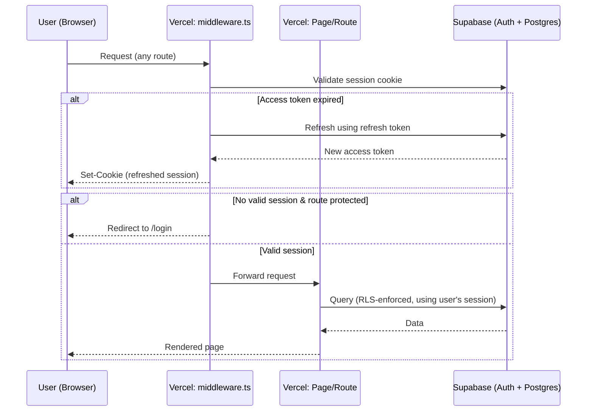

# Design: Auth & Access Foundation (Chunk 1)

**Status:** Approved
**Date:** 2026-08-07
**Related:** [PRD §4 Target Users](../prd.md#4-target-users), [PRD §6.4 Access & Sharing](../prd.md#64-access--sharing)

## Purpose

Establish login, session management, and route/data gating for ChartBoard. This is the foundation every later chunk (chart library, setlists, performance mode, admin tools) builds on top of.

**Scope for this chunk:** solo-developer use only. One account, created manually — no self-serve sign-up, no invite emails, no OAuth. Those are explicitly deferred (see Out of Scope below) but the schema and gating design are shaped so they can be added later without rework.

## Architecture

**Stack:** Next.js 16 (App Router, TypeScript), Node.js 24

**Backend:** Supabase (Free tier), used as both the **Postgres database** (for the `profiles` table and future chart/setlist tables) and **Auth provider** (email+password login, session/JWT issuance) — hosted project (not local), accessed via `@supabase/supabase-js` as the client library and `@supabase/ssr` for cookie-based session handling across server/client in the App Router.

Note: free-tier Supabase projects auto-pause after ~1 week of inactivity and require a manual resume in the dashboard. No in-app handling needed for this at solo-dev scale.

**Deployment:** Vercel (Free tier), deployed via GitHub integration; served at a custom domain (Cloudflare DNS) rather than the default `*.vercel.app`.

**Env vars:**
- `NEXT_PUBLIC_SUPABASE_URL` — client-safe, identifies the Supabase project
- `NEXT_PUBLIC_SUPABASE_ANON_KEY` — client-safe, used for normal requests (actual access enforced by RLS, not this key)
- `SUPABASE_SERVICE_ROLE_KEY` — server-only, bypasses RLS entirely; unused until chunk 9 admin tooling

**Styling:** Tailwind CSS + shadcn/ui (Radix-based, copy-owned components, de facto standard for Next.js in 2026)

**Out of scope for this chunk:**
- GitHub Actions CI/CD, Dependabot, CodeQL — separate follow-up task, unrelated to auth
- Resend/SMTP — needed starting chunk 9 (admin invite emails)
- Google OAuth as an additional sign-in provider — planned future addition; no schema impact since Supabase Auth providers share the same `auth.users` identity. When added, the `profiles` auto-provisioning trigger will be updated to populate `display_name` from `raw_user_meta_data`, rather than requiring a schema change.

### Request flow

Gating is two-layered by design (see Error Handling): middleware is the fast UX-level redirect, RLS on the database is the actual security boundary in case app-layer checks are ever bypassed or misconfigured.

## Components

- **`lib/supabase/client.ts`** — browser Supabase client, used by the login form
- **`lib/supabase/server.ts`** — server Supabase client, used by Server Components/Route Handlers/Server Actions
- **`middleware.ts`** — refreshes the session cookie and gates protected routes on every request
- **`app/login/page.tsx`** — login form (email + password, Tailwind + shadcn/ui), client component calling `supabase.auth.signInWithPassword()`
- **`app/(protected)/layout.tsx`** — route group wrapping all real app pages; independent server-side `getUser()` check as a second gating layer
- **`app/(protected)/dashboard/page.tsx`** — placeholder protected page ("Logged in as `<email>` — role: `<role>`"), proves the full gating chain works since no chart/setlist UI exists yet
- **Logout Server Action** — calls `supabase.auth.signOut()`, redirects to `/login`
- **`profiles` table**:
  - `id` (uuid, FK to `auth.users.id`)
  - `role` (`'admin' | 'member'`, default `'member'`)
  - `display_name` (text, nullable — no UI to set it in this chunk; set manually via SQL for now, populated from OAuth metadata in a future chunk)
  - `created_at`
  - RLS: a user may `SELECT`/`UPDATE` only their own row
- **DB trigger on `auth.users` insert** — auto-creates the matching `profiles` row, so this works the same whether the user is created via the dashboard (now) or via invite signup (chunk 9) — no special-casing needed later
- **One-off manual SQL** (run once, not app code): set your own `profiles` row's `role` to `'admin'`, optionally set `display_name`

## Data Flow

1. **Login:** user submits the form on `/login` → browser client calls `signInWithPassword()` → Supabase validates credentials and returns a session → `@supabase/ssr` writes it to cookies → redirect to `/dashboard`.
2. **Every request thereafter:** `middleware.ts` validates/refreshes the session cookie and redirects to `/login` if there's no valid session on a protected path.
3. **Protected page render:** `(protected)/layout.tsx` performs its own server-side `getUser()` check; the dashboard page queries `profiles` for the current user's row (RLS-scoped) to display role.
4. **Logout:** button triggers the Server Action → `signOut()` clears the session → redirect to `/login`.

## Error Handling

- **Invalid login credentials:** `signInWithPassword()` returns an error; the login form displays a generic inline message ("Invalid email or password") without revealing which field was wrong.
- **Expired/missing session on a protected route:** `middleware.ts` redirects to `/login` before the page renders.
- **Middleware bypassed or misconfigured** (e.g. a future route not covered by the middleware matcher): `(protected)/layout.tsx` performs its own independent `getUser()` check and redirects regardless of whether middleware ran — defense in depth, not reliant on a single config being correct.
- **RLS denies a query:** treated as a genuine edge case in the UI (generic "something went wrong" state), not expected in normal operation — indicates a policy or query bug if it occurs.
- **Supabase project paused** (free-tier auto-pause): requests fail/timeout; no special in-app handling at solo-dev scale — resume manually via the Supabase dashboard.

## Testing

Manual verification checklist for everything that touches Supabase — low value to unit test integration glue against a real external auth service (a mocked test would just re-assert the mock, not catch real cookie/RLS bugs); revisit with Playwright once more gated surface area exists, e.g. after chart/setlist gating is built.

**Exception:** the middleware's route-protection predicate (`isProtectedPath`) is pure logic with no external dependency and real edge cases (exact match vs. a path that merely starts with the same prefix) — it gets a unit test (Vitest). This is the only unit-tested code in this chunk.

- [ ] Log in with correct credentials → lands on `/dashboard`, shows email + `admin` role
- [ ] Log in with wrong password → inline error shown, stays on `/login`
- [ ] Visit `/dashboard` directly while logged out → redirected to `/login`
- [ ] Reload `/dashboard` while logged in → session persists, no redirect
- [ ] Log out → redirected to `/login`; visiting `/dashboard` afterward redirects again
- [ ] Force an access-token expiry → confirm middleware silently refreshes the session rather than logging out

## Account Creation

Manual, via the Supabase Auth dashboard — no sign-up UI in this chunk. Self-serve invite-link signup is deferred to chunk 9, after the group is ready to be onboarded post-v1.
